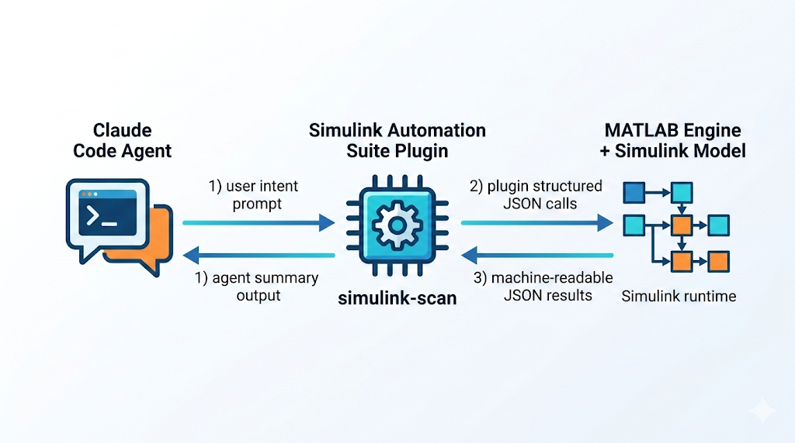
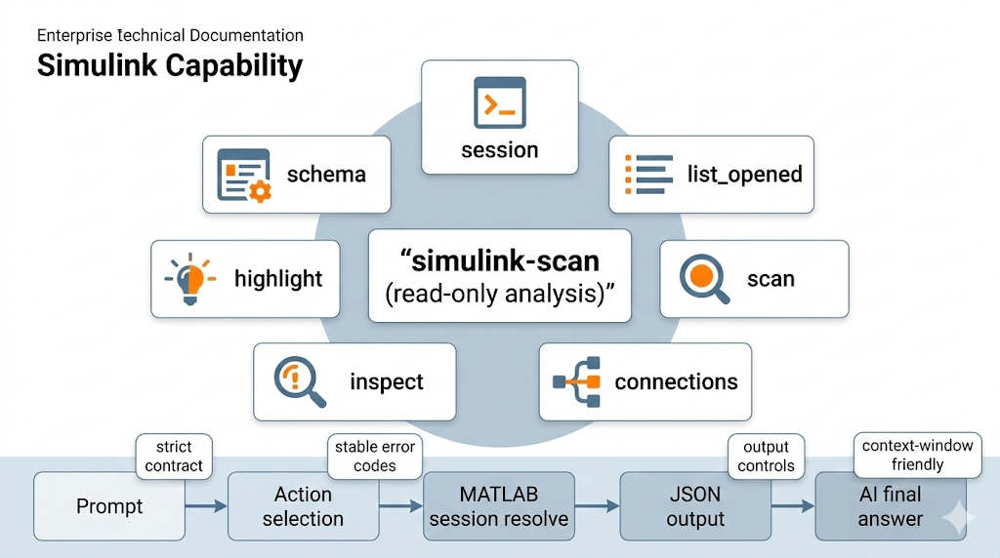
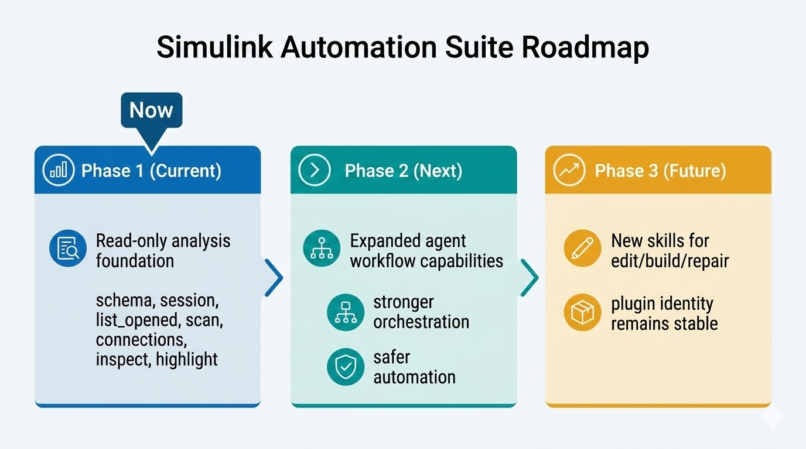

**Language:** **English** | [简体中文](README.zh-CN.md)

# Simulink Automation Suite


Simulink Automation Suite is a Claude Code plugin for Simulink automation workflows through MATLAB Engine for Python.

- Canonical plugin name: `simulink-automation-suite`
- **Read Analysis** — the `simulink-analyzer` agent autonomously explores model topology, traces connections, audits parameters, and returns structured findings without polluting conversation context.
- **Write Automation** — the `simulink-automation` skill guides safe parameter modification with dry-run preview, precondition guards, and rollback support.
- Runtime Python module path: `simulink_cli` (unified CLI entrypoint)

---

## Positioning

Simulink Automation Suite is built to make Simulink analysis agent-native in Claude Code:

- It exposes Simulink context as deterministic, machine-readable tool outputs.
- It lets AI reason on real model topology/parameters instead of screenshots.
- It keeps workflows real-time and token-efficient with clipping/projection controls.

In short: the plugin helps AI *understand first, then assist*.



---

## Why This Plugin Exists

Common AI+Simulink workflows are often one of these:

1. Screenshot-based discussion: fast but shallow, visual-only understanding.
2. Export-and-parse flow: richer context but heavy, delayed, and token-expensive.

This plugin provides a third path: direct, structured, runtime model analysis for agents.



---

## How It Works

1. Claude Code invokes the `simulink-automation` skill for write/meta tasks, or dispatches the `simulink-analyzer` agent for read analysis.
2. The skill resolves MATLAB session context (`session list/use/current/clear`) with exact-name matching, using either an explicit `--session` or a previously selected active session.
3. It executes one of the available actions: `schema`, `list_opened`, `scan`, `connections`, `inspect`, `find`, `highlight`, `set_param`, `model_new`, `model_open`, `model_save`, or `session`.
4. Results are returned as a single machine-readable JSON payload on `stdout`; warnings never spill raw text into stdout, and `stderr` is reserved for maintainer-facing diagnostics.
5. Failures use stable error codes for reliable agent recovery.
6. Write operations (`set_param`) use dry-run preview (default), machine-executable `apply_payload`, rollback payloads, guarded execute via `expected_current_value`, and read-back verification.

---

## Prerequisites

Before using session-bound actions (`list_opened`, `scan`, `connections`, `inspect`, `find`, `highlight`):

1. Install and activate MATLAB on your machine.
2. Install MATLAB Engine for Python in the same Python interpreter that runs this plugin.
3. In MATLAB Command Window, run:

```matlab
matlab.engine.shareEngine
```

Troubleshooting:

- `engine_unavailable`: MATLAB Engine for Python is unavailable in the active Python environment. Fix interpreter/environment installation.
- `no_session`: MATLAB Engine is available, but no shared MATLAB session is visible. Run `matlab.engine.shareEngine` in MATLAB, then retry.

---

## Quick Start

### 1. Add the marketplace source

```bash
/plugin marketplace add Mistakey/simulink-automation-suite
```

### 2. Install the plugin from marketplace

```bash
/plugin install simulink-automation-suite@simulink-automation-marketplace
```

### 3. Invoke the namespaced skill

```text
/simulink-automation-suite:simulink-automation Scan gmp_pmsm_sensored_sil_mdl recursively and focus on controller subsystems.
```

### 4. Verify plugin registration (optional)

```bash
/plugin list simulink-automation-suite@simulink-automation-marketplace
```

---

## Scenario Examples

For end-to-end Claude Code prompts and screenshots (single bilingual page), see:

- [docs/examples/claude-code-scenarios.md](docs/examples/claude-code-scenarios.md)

---

## Core Actions

| Action | Purpose | Example |
|---|---|---|
| `schema` | Return machine-readable command contract | `python -m simulink_cli schema` |
| `list_opened` | List currently opened Simulink models | `python -m simulink_cli list_opened` |
| `scan` | Read model/subsystem topology | `python -m simulink_cli scan --model "my_model" --recursive` |
| `connections` | Read upstream/downstream key modules for a target block | `python -m simulink_cli connections --target "my_model/Gain" --direction both --depth 1 --detail summary` |
| `inspect` | Read block parameters/effective values | `python -m simulink_cli inspect --model "my_model" --target "my_model/Gain" --param "All"` |
| `highlight` | Highlight a block in Simulink (UI-only, no model mutation) | `python -m simulink_cli highlight --target "my_model/Gain"` |
| `find` | Search blocks by name pattern and/or block type | `python -m simulink_cli find --model "my_model" --name "PID"` |
| `set_param` | Set a block parameter with dry-run preview and rollback | `python -m simulink_cli set_param --target "my_model/Gain1" --param "Gain" --value "2.0"` |
| `model_new` | Create a new Simulink model | `python -m simulink_cli --json '{"action":"model_new","name":"my_model"}'` |
| `model_open` | Open a Simulink model from file | `python -m simulink_cli --json '{"action":"model_open","path":"C:/models/my_model.slx"}'` |
| `model_save` | Save a loaded Simulink model | `python -m simulink_cli --json '{"action":"model_save","model":"my_model"}'` |
| `session` | Manage or select the active MATLAB shared session | `python -m simulink_cli session list` |

---

## Output Controls

Use output clipping/projected fields when you need compact payloads:

```bash
python -m simulink_cli scan --model "my_model" --max-blocks 200 --fields "name,type"
python -m simulink_cli inspect --model "my_model" --target "my_model/Gain" --param "All" --max-params 50 --fields "target,values"
python -m simulink_cli connections --target "my_model/Gain" --detail ports --max-edges 50 --fields "target,edges,total_edges,truncated"
python -m simulink_cli find --model "my_model" --name "PID" --max-results 50 --fields "path,type"
```

---

## JSON Request Mode

`--json` is a first-class entrypoint and is mutually exclusive with flag-based action arguments.
`schema` returns structured metadata for each action field (type, required/default/enum, description).
JSON mode is the canonical contract surface for complex strings and newlines; use it whenever values need escaping or contain embedded line breaks.

```bash
python -m simulink_cli --json "{\"action\":\"schema\"}"
python -m simulink_cli --json "{\"action\":\"list_opened\",\"session\":\"MATLAB_12345\"}"
python -m simulink_cli --json "{\"action\":\"scan\",\"model\":\"my_model\",\"recursive\":true,\"session\":\"MATLAB_12345\"}"
python -m simulink_cli --json "{\"action\":\"inspect\",\"model\":\"my_model\",\"target\":\"my_model/Gain\",\"param\":\"Description\",\"summary\":true}"
python -m simulink_cli --json '{"action":"connections","target":"my_model/Gain","direction":"both","depth":1,"detail":"summary","max_edges":50,"fields":["target","upstream_blocks","downstream_blocks"]}'
python -m simulink_cli --json '{"action":"find","model":"my_model","name":"PID","max_results":50,"fields":["path","type"]}'
python -m simulink_cli --json '{"action":"set_param","target":"my_model/Gain1","param":"Gain","value":"2.0"}'
python -m simulink_cli --json '{"action":"model_new","name":"my_model"}'
python -m simulink_cli --json '{"action":"model_open","path":"C:/models/my_model.slx"}'
python -m simulink_cli --json '{"action":"model_save","model":"my_model"}'
```

---

## Safety Model (Write Operations)

- `dry_run` defaults to `true` and returns both `rollback` and machine-executable `apply_payload`
- `apply_payload` carries `expected_current_value`, so execute can reject stale previews instead of mutating blindly
- Replay the returned `apply_payload` exactly; do not manually reconstruct the guarded execute payload
- Stale preview replay returns `precondition_failed` without mutating the model
- Execute mode reads back the value to verify the write
- If read-back does not confirm the requested value, the action returns `verification_failed` and preserves rollback/write-state recovery metadata
- Every response includes a `rollback` payload for one-command undo, preserving an explicit session override when one was used
- The `value` field is always a string and may legitimately include literal percent signs, for example `"%.3f"`
- One parameter per invocation (no batch operations)

## Guarded Edit Loop

The standard single-parameter agent loop is:

1. `inspect` the current parameter state.
2. Run `set_param` with `dry_run=true`.
3. Replay the returned `apply_payload`.
4. `inspect` again to confirm the new value.
5. Replay `rollback` if you need to restore the original value.

Preview response excerpt:

```json
{
  "action": "set_param",
  "dry_run": true,
  "current_value": "1.5",
  "proposed_value": "2.0",
  "apply_payload": {
    "action": "set_param",
    "target": "my_model/Gain1",
    "param": "Gain",
    "value": "2.0",
    "dry_run": false,
    "expected_current_value": "1.5"
  },
  "rollback": {
    "action": "set_param",
    "target": "my_model/Gain1",
    "param": "Gain",
    "value": "1.5",
    "dry_run": false
  }
}
```

If the target changes between preview and execute, replaying that saved `apply_payload` returns `precondition_failed`. If the write runs but read-back does not confirm it, the action returns `verification_failed`.

---

## Strict Defaults and Error Contract

- Session matching is exact-only (no fuzzy matching).
- If multiple MATLAB shared sessions exist, either select one via `session use <name>` or pass `--session` explicitly for MATLAB-bound actions.
- If no opened model can be resolved to an active root, `scan` and `find` return `model_not_found`.
- `unknown_parameter` means the caller supplied a request field or flag that is not part of the contract.
- `param_not_found` means the target block does not expose the requested runtime parameter.
- Invalid JSON or wrong JSON field types return `invalid_json`.

Error envelope:

```json
{
  "error": "<stable_code>",
  "message": "<human_readable_message>",
  "details": {},
  "suggested_fix": "<optional_next_step>"
}
```

Common error codes:

- `invalid_input`
- `invalid_json`
- `unknown_parameter`
- `json_conflict`
- `engine_unavailable`
- `no_session`
- `session_required`
- `session_not_found`
- `state_write_failed`
- `state_clear_failed`
- `model_required`
- `model_not_found`
- `subsystem_not_found`
- `invalid_subsystem_type`
- `block_not_found`
- `param_not_found`
- `precondition_failed`
- `set_param_failed`
- `verification_failed`
- `model_already_loaded`
- `model_save_failed`
- `inactive_parameter`
- `runtime_error`

Session management commands may return `state_write_failed` or `state_clear_failed` when the local plugin state file is not writable.

If no MATLAB shared session exists, run `matlab.engine.shareEngine` in MATLAB and retry.

---

## What's Inside

```text
simulink_cli/           # Unified CLI package (single entrypoint)
├── __main__.py         # python -m simulink_cli
├── core.py             # Action registry, JSON/flag parsing, schema, routing
├── errors.py           # Error envelope builder
├── json_io.py          # JSON I/O utilities
├── validation.py       # Input hardening
├── session.py          # MATLAB session management
├── model_helpers.py    # Path resolution helpers
└── actions/            # One module per action
    ├── scan.py
    ├── inspect_block.py
    ├── connections.py
    ├── find.py
    ├── highlight.py
    ├── list_opened.py
    ├── set_param.py
    ├── model_new.py
    ├── model_open.py
    ├── model_save.py
    └── session_cmd.py
agents/                 # Published agent definitions
└── simulink-analyzer.md  # Read-analysis agent (topology, search, connections, inspection)
skills/                 # Plugin skill definitions (docs only, no Python code)
└── simulink_automation/  # Write automation + meta-query skill
    ├── SKILL.md
    └── reference.md
tests/                  # Test suite
```

---

## Verification

```bash
python -m unittest discover -s tests -p "test_*.py" -v
claude plugin validate .
```

---

## Roadmap

- **Current (v2.2.x):** read-only analysis via `simulink-analyzer` agent, guarded parameter modification and model lifecycle management via `simulink-automation` skill, all through the unified `simulink_cli` package.
- **Next:** strengthen agent workflow orchestration and reliability while preserving deterministic contracts and recovery paths.
- **Future:** add new skills for build/repair scenarios without renaming the plugin (`simulink-automation-suite` remains the stable identity).


