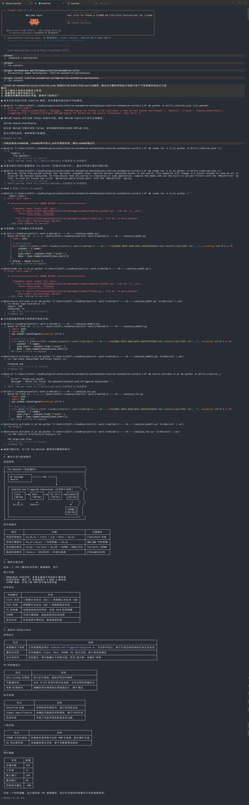
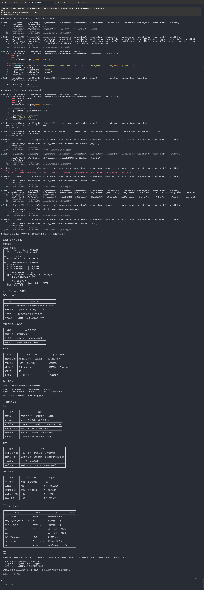
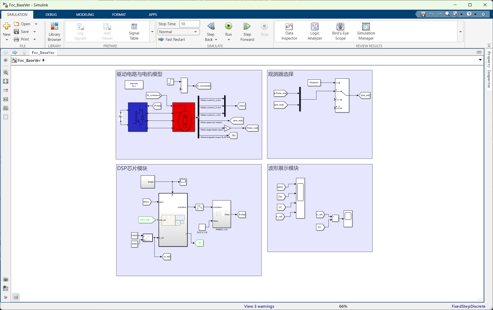
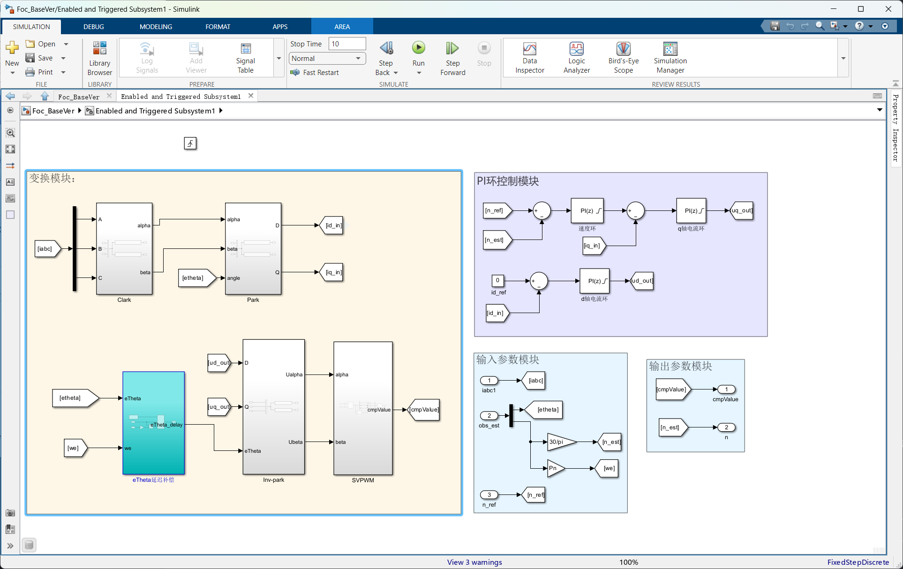
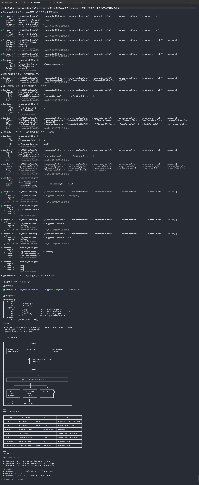

# Claude Code Scenario Examples / Claude Code 使用示例

This page keeps prompt examples and screenshots out of the main README to reduce page weight.
该页面用于承载 Prompt 示例与截图，避免主 README 过重。

## Scenario A: Model Structure Analysis / 场景 A：模型结构分析

Prompt:

```text
/simulink-automation-suite:simulink-scan
Please recursively analyze the currently opened Simulink model.
Focus on architecture and subsystem design.
Output:
1) key module paths and relationships
2) main purpose of the model
3) three subsystems worth deeper review
```

Screenshot:



## Scenario B: Focused Module Review / 场景 B：特定模块深挖

Prompt:

```text
/simulink-automation-suite:simulink-scan
Analyze the model's SVPWM module deeply.
Output:
1) major differences from common SVPWM implementations
2) key pros/cons
3) parameters to inspect next
```

Screenshot:



## Scenario C: Highlight + Connections / 场景 C：定位高亮与连接分析

Prompt:

```text
/simulink-automation-suite:simulink-scan
Locate and highlight the angle compensation block in the model,
then report key upstream/downstream connected modules.
```

Before highlight:



After highlight:



Claude output:


